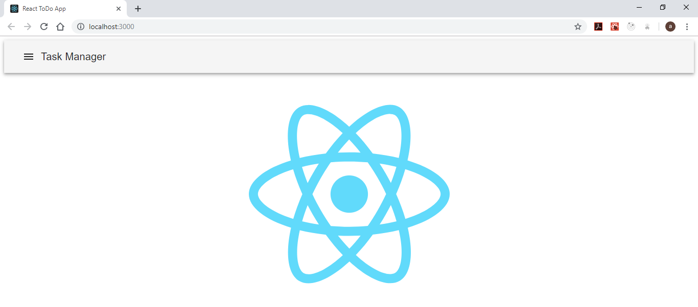
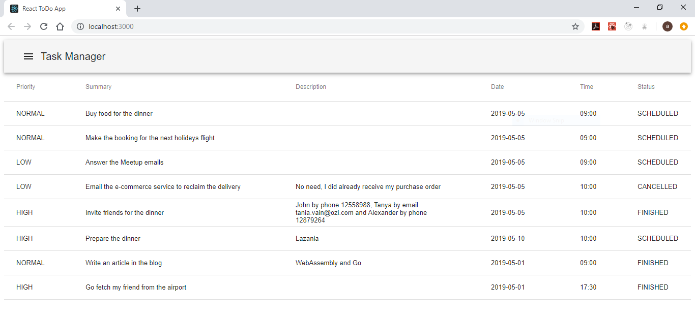
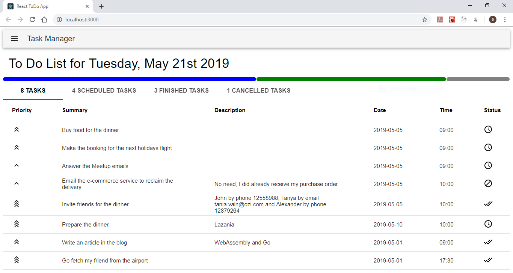
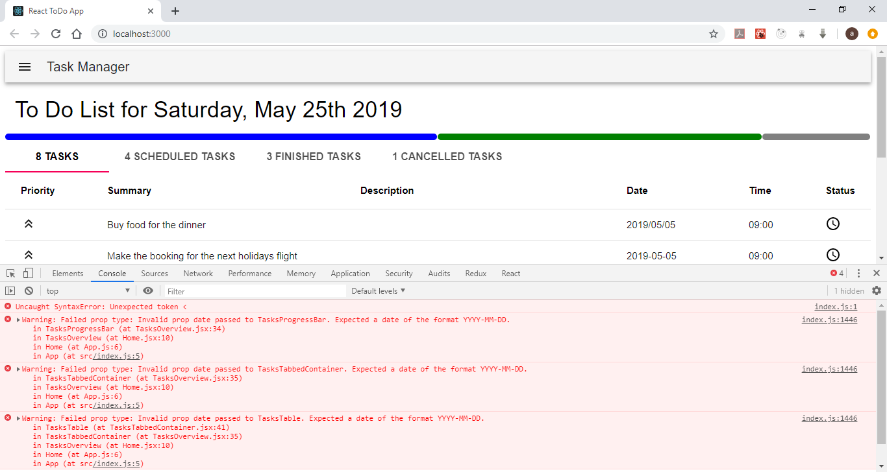
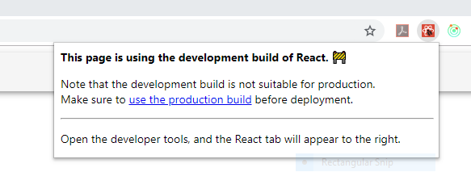
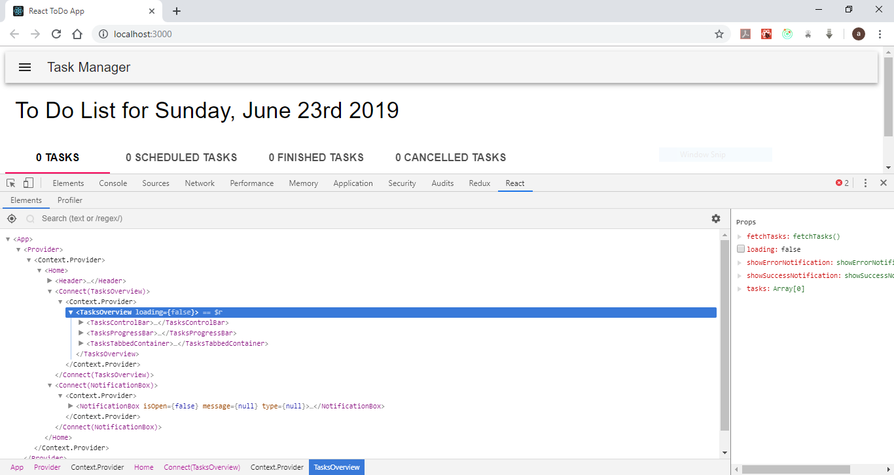
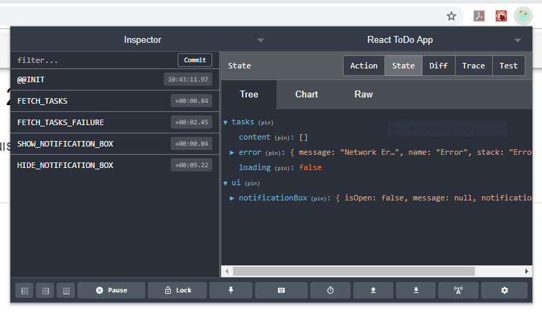
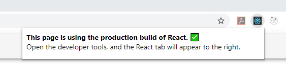
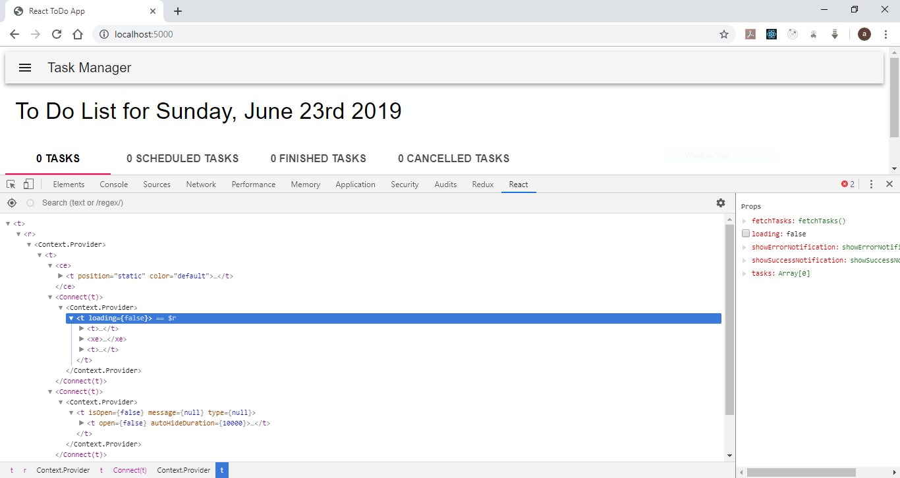

# Task Manager GUI
This is the actual React user interface that we'll use as an elaborate and progressive example for the training.

We did follow the steps below when creating our application:
- [Task Manager GUI](#Task-Manager-GUI)
  - [Initialize the project](#Initialize-the-project)
  - [Display mock data in a table](#Display-mock-data-in-a-table)
  - [Display the tasks in a tabbed view with a progress bar](#Display-the-tasks-in-a-tabbed-view-with-a-progress-bar)
  - [Styling the components the right way](#Styling-the-components-the-right-way)
  - [Checking props with PropTypes](#Checking-props-with-PropTypes)
  - [Introducing Redux](#Introducing-Redux)
  - [Managing environment based configuration](#Managing-environment-based-configuration)

## Initialize the project
We'll start by creating a blank React application using the command line tool [`create-react-app`](https://github.com/facebook/create-react-app). First we have to install it by invoking
``` Bash
npm install --global create-react-app
```
once finished, we'll create our template
``` Bash
create-react-app task-manager-web-app
cd task-manager-web-app
```
We did change the content and a little bit in the structure of the generated template as shown in the current Git Branch. Under the folder `src` we deleted all the files and we created a folder called `Home` to hold the main page. As shown in the code, we did adopt the [Material UI](https://material-ui.com/) library. Use the following commands to install the Material UI library
``` Bash
npm install @material-ui/core
npm install @material-ui/icons
```
Run the following commands to start the application
``` Bash
npm run build
npm start
```



:information_source: install the [React Snippets](https://marketplace.visualstudio.com/items?itemName=dsznajder.es7-react-js-snippets) VSCode extension to type React specific code faster.

**[:arrow_double_up: Steps](#task-manager-gui)**

## Display mock data in a table
We began by displaying mock data in a tabular form in the front page. We did create two functional React components which are the header and the tasks table.
``` JavaScript
export default function Header() {
  return (
    <AppBar position="static" color="default">
      <Toolbar>
        <IconButton color="inherit" aria-label="Menu">
          <MenuIcon />
        </IconButton>
        <Typography variant="h6" color="inherit">
          Task Manager
        </Typography>
      </Toolbar>
    </AppBar>
  );
}
```
``` JavaScript
export default function TasksTable(props) {
  const { tasks } = props;
  return (
    <Table>
      .
      .
      .
      <TableBody>
        {tasks.map(task => (
          <TableRow key={task.id}>
            <TableCell align="left">{task.priority}</TableCell>
            <TableCell align="left">{task.summary}</TableCell>
            <TableCell align="left">{task.description}</TableCell>
            <TableCell align="left">{task.date}</TableCell>
            <TableCell align="left">{task.time}</TableCell>
            <TableCell align="left">{task.status}</TableCell>
          </TableRow>
        ))}
      </TableBody>
    </Table>
  );
}
```
The home page is represented by a class component and did have a state to read mock tasks list at startup.
``` JavaScript
import React, { Component } from 'react';
import Header from '../UI/Header';
import TasksTable from '../TaskManagement';
import mockTasks from '../../shared/mocks/tasks';

export default class Home extends Component {
  constructor(props) {
    super(props);
    this.state = {
      tasks: [],
    };
  }

  componentDidMount() {
    this.setState({
      tasks: mockTasks,
    });
  }

  render() {
    const { tasks } = this.state;
    return (
      <React.Fragment>
        <Header />
        <div style={{ height: '100%', width: '100%' }}>
          <TasksTable tasks={tasks} />
        </div>
      </React.Fragment>
    );
  }
}
```



**[:arrow_double_up: Steps](#task-manager-gui)**

## Display the tasks in a tabbed view with a progress bar
In this step, we did make more components to display in details the tasks' status. Those components are (for the moment) a progress bar indicating the percent of done tasks and a tabbed view with tasks by status. The definition of the components are under the folder `src/components/TaskManagement`.


**[:arrow_double_up: Steps](#task-manager-gui)**

## Styling the components the right way
Our components are a mix of JSX syntax with _inline Styling_ for CSS  
``` JavaScript
export default class Home extends Component {
  .
  .
  .

  render() {
    const { tasks } = this.state;
    return (
      <React.Fragment>
        <Header />
        <div style={{ height: '100%', width: '100%' }}>
          <TasksTable tasks={tasks} />
        </div>
      </React.Fragment>
    );
  }
}
```
this method of adding custom appearance via inline styles is not appropriate as it makes our components 'bloated' with code that can be externalized. Many techniques exists to add styling to React components mainly **_React CSS Modules_**  
``` JavaScript
import React, { Component } from 'react';
  .
  .
  .
import styles from './TasksOverview.module.css';

export default class TasksOverview extends Component {
  .
  .
  .

  render() {
    const { tasks } = this.state;
    return (
      <React.Fragment>
        <div className={styles.topContainer}>
          .
          .
          .
        </div>
        <TasksProgressIndicator tasks={tasks} />
        <TasksTabbedContainer tasks={tasks} />
      </React.Fragment>
    );
  }
}
```
and the CSS is externalized in the separate file _TasksOverview.module.css_ as the following  
``` CSS
.topContainer {
  margin-top: 23px;
  margin-bottom: 17px;
  margin-left: 15px;
}
```
:warning: because we did use the _create-react-app_ tool, the _Webpack_ configuration for loading CSS requires the naming convention `[name].module.css` as mentioned in its [official documentation](https://facebook.github.io/create-react-app/docs/adding-a-css-modules-stylesheet).

:information_source: if you want to take a look at the 'hidden' boilerplate configuration files that _create-react-app_ did use and ,by the way, take back control of your environment, you can invoque the command  
``` Bash
npm run eject
```
this will copy all the configuration files in your local folder so you can edit them. Add the following content to you Webpack configuration file  
``` JavaScript
{
  loader: require.resolve('css-loader'),
  options: {
    importLoaders: 1,
    modules: true,
    localIdentName: "[name]_[local]_[hash:base64:5]"  
  },
},
```
this instructs Webpack to create CSS files with local scope having randomly hashed name.

:warning: the command `npm run eject` is irreversible.

The second technique used for styling React components is **_CSS in JS_**. In fact, _material-ui_ components have their own styles and they cannot be overridden using the usual React CSS Modules used above.
``` JavaScript
import React, { Component } from 'react';
  .
  .
  .
import styles from './TasksTabbedContainer.styles';

export default class TasksTabbedContainer extends Component {
  .
  .
  .

  render() {
    const { tasks } = this.props;
    .
    .
    .
    return (
      <React.Fragment>
        <Tabs value={selectedTabIndex} onChange={this.handleChange}>
          <Tab style={styles.tabContent} label={`${totalTasksCount} tasks`} />
          .
          .
          .
      </React.Fragment>
    );
  }
}
```
the file _TasksTabbedContainer.styles.js_ contains the style description as JavaScript objects  
``` JavaScript
const styles = {
  tabContent: {
    fontSize: '1em',
    fontWeight: 'bold',
  },
};

export default styles;
```



**[:arrow_double_up: Steps](#task-manager-gui)**

## Checking props with PropTypes
Props are the mechanism used by the components to pass values. We need often to check the integrity of the passed types in props, for example ensuring that a date is passed not a string or that a mandatory prop value is not missing. React offers PropTypes to check for props passed for functional and class components. In our project, a list of tasks is passed between components, and the task type has well defined mandatory attributes as shown below  
``` JavaScript
import PropTypes from 'prop-types';
import CustomProps from './customProps';
import { TASK_PRIORITY_VALUES, TASK_STATUS_VALUES } from '../common/utils/taskUtils';

const task = {
  id: PropTypes.number,
  summary: PropTypes.string.isRequired,
  description: PropTypes.string,
  priority: PropTypes.oneOf(TASK_PRIORITY_VALUES).isRequired,
  date: CustomProps.localDateString,
  time: CustomProps.localTimeString,
  status: PropTypes.oneOf(TASK_STATUS_VALUES).isRequired,
};

export default PropTypes.shape(task);
```
the `id` is a number, the `summary` is mandatory string, the `priority` has values from a well known enumeration. We also define our custom PropTypes as shown below  
``` JavaScript
import moment from 'moment';

const STRICT = true;
const MANDATORY = true;

const validateDateString = (props, propName, componentName, format, mandatory) => {
  const dateString = props[propName];
  if (mandatory && !(propName in props)) {
    return Error(`Missing ${propName}.`);
  }
  if (!moment(dateString, format, STRICT).isValid()) {
    return Error(`Invalid prop ${propName} passed to ${componentName}. Expected a date of the format ${format}.`);
  }
};

const CustomProps = {
  localDateString: (props, propName, componentName) =>
    validateDateString(props, propName, componentName, 'YYYY-MM-DD', MANDATORY),
  localTimeString: (props, propName, componentName) =>
    validateDateString(props, propName, componentName, 'HH:mm', MANDATORY),
};

export default CustomProps;
```
where we did ensure that the date and time formats are correct. Once the PropTypes defined, the components can use them for type checking  
``` JavaScript
import React from 'react';
import PropTypes from 'prop-types';
import Tooltip from '@material-ui/core/Tooltip';
import task from '../../../prop-types/taskPropType';
import { countScheduledTasks, countFinishedTasks, countCancelledTasks } from '../../../common/utils/taskUtils';
import styles from './TasksProgressBar.module.css';

export default function TasksProgressBar(props) {
  .
  .
  .
  return (
    <React.Fragment>
      .
      .
      .
    </React.Fragment>
  );
}

TasksProgressBar.propTypes = {
  tasks: PropTypes.arrayOf(task),
};
```
You can test the type validation by providing wrong data format in input anb observing the error message in the console.



**[:arrow_double_up: Steps](#task-manager-gui)**

## Introducing Redux
We'll adopt the [_Redux_](https://redux.js.org/) library in order to keep a coherent state between components. We start by adding the Redux dependency to our project.
``` Bash
npm install --save react-redux
npm install --save redux
```
once installed, we have to define our _Initial State_ for the tasks, i.e how we'll store the tasks in the _Store_
``` JavaScript
const initialState = {
  content: [],
  error: null,
  loading: false,
};
```
we have to define the main _Actions Types_ (fetching tasks, adding a task)
``` JavaScript
export const FETCH_TASKS = 'FETCH_TASKS';
export const FETCH_TASKS_SUCCESS = 'FETCH_TASKS_SUCCESS';
export const FETCH_TASKS_FAILURE = 'FETCH_TASKS_FAILURE';

export const ADD_TASK = 'ADD_TASK';
export const ADD_TASK_SUCCESS = 'ADD_TASK_SUCCESS';
export const ADD_TASK_FAILURE = 'ADD_TASK_FAILURE';
```
in this case, we did adopt a specific pattern in order to track the outcome of a given action. We split it into three main phases (action start `ADD_TASK`, action success `ADD_TASK_SUCCESS`, action failure `ADD_TASK_FAILURE`).
Next, the definition of the _Reducer_ will be as follow
``` JavaScript
export default function tasksReducer(state = initialState, action) {
  switch (action.type) {
    case FETCH_TASKS:
    case ADD_TASK:
      return {
        ...state,
        ...state.tasks,
        loading: true,
      };
    case FETCH_TASKS_SUCCESS:
      return {
        ...state,
        content: action.tasks,
        error: null,
        loading: false,
      };
    case ADD_TASK_SUCCESS:
      return {
        ...state,
        content: [...state.tasks.content, action.tasks],
        error: null,
        loading: false,
      };
    case FETCH_TASKS_FAILURE:
    case ADD_TASK_FAILURE:
      return {
        ...state,
        ...state.tasks,
        error: action.error,
        loading: false,
      };
    default:
      return state;
  }
}
```
the above reducer will accept the _Actions_ dispatched from the components
``` JavaScript
import { getAllTasks } from '../../common/api/tasksApi';
import { FETCH_TASKS, FETCH_TASKS_SUCCESS, FETCH_TASKS_FAILURE } from '../actionTypes';

export const fetchAllTasksSuccess = tasks => ({ type: FETCH_TASKS_SUCCESS, tasks });

export const fetchAllTasksFailure = error => ({ type: FETCH_TASKS_FAILURE, error });

export const fetchAllTasks = () => dispatch => {
  dispatch({ type: FETCH_TASKS });
  return getAllTasks()
    .then(response => {
      dispatch(fetchAllTasksSuccess(response));
      return response;
    })
    .catch(error => {
      dispatch(fetchAllTasksFailure(error));
      throw error;
    });
};

export default fetchAllTasks;
```
a typical _Action_ is defined by a type and a payload
``` JavaScript
{ type: FETCH_TASKS_SUCCESS, tasks }
```
The same steps are used to create another coherent state for the UI to manage components' visibility. The _Store_ has to be exposed
``` JavaScript
import { createStore, combineReducers, applyMiddleware } from 'redux';
import { composeWithDevTools } from 'redux-devtools-extension';
import thunk from 'redux-thunk';
import { tasksReducer, uiReducer } from './reducers';

export const store = createStore(
  combineReducers({
    tasks: tasksReducer,
    ui: uiReducer,
  }),
  composeWithDevTools(applyMiddleware(thunk))
);
```
we used the call `createStore` with the combined reducers for the tasks and the UI `combineReducers` and the [_Thunk_](https://github.com/reduxjs/redux-thunk) middleware to manage asynchronous calls.  
Finally, the components must dispatch the actions in order to interact with the Redux store.
``` JavaScript
export default class TasksOverview extends Component {
  componentDidMount() {
    const { fetchTasks, showErrorNotification, showSuccessNotification } = this.props;
    fetchTasks()
      .then(response => {
        showSuccessNotification(`${response.length} tasks found`);
      })
      .catch(error => {
        showErrorNotification(error.message);
      });
  }

  render() {
    const { loading, tasks } = this.props;
    return (
      <React.Fragment>
        <TasksControlBar />
        <TasksProgressBar tasks={tasks} />
        <TasksTabbedContainer tasks={tasks} />
        {loading && (
          <React.Fragment>
            <div className={styles.contentLoading} />
            <Spinner />
          </React.Fragment>
        )}
      </React.Fragment>
    );
  }
}

TasksOverview.propTypes = {
  fetchTasks: PropTypes.func,
  showErrorNotification: PropTypes.func,
  showSuccessNotification: PropTypes.func,
  tasks: PropTypes.arrayOf(task),
  loading: PropTypes.bool,
};
```
the component shown above is not "aware" of Redux, it did receive props from its connected version defined in the file `index.js`
``` JavaScript
import { connect } from 'react-redux';
import TasksOverview from './TasksOverview';
import { fetchAllTasks, showErrorNotification, showSuccessNotification } from '../../../redux/actions';

const mapStateToProps = state => {
  return {
    tasks: state.tasks.content,
    loading: state.tasks.loading,
  };
};

const mapDispatchToProps = dispatch => {
  return {
    fetchTasks: () => dispatch(fetchAllTasks()),
    showErrorNotification: message => dispatch(showErrorNotification(message)),
    showSuccessNotification: message => dispatch(showSuccessNotification(message)),
  };
};

export default connect(
  mapStateToProps,
  mapDispatchToProps
)(TasksOverview);
```
we used the functions `mapStateToProps`, to fetch values from the store, and `mapDispatchToProps` to dispatch actions to the store.  
In order to test the actual state of the application, start the [_Tasks API_](../task-manager-back-end) and then start the React front end to fetch directly tasks from the backend. The direct call to the API is seen in the file `tasksApi.js`
``` JavaScript
import axios from 'axios';

export const getAllTasks = () => {
  return axios
    .get('http://localhost:9090/task-manager/api/v1/tasks') //-
    .then(response => {
      return response.data.tasks;
    });
};
```

**[:arrow_double_up: Steps](#task-manager-gui)**

## Managing environment based configuration
If you take a look at the file `tasksApi.js` you'll notice two things:
- we used the library [_axios_](https://github.com/axios/axios) to make asynchronous API calls, of course we did install it using the command `npm install axios`
- the URL is hard coded which is not a good practice at all, as we are supposed to deploy our application in various environments namely _Development_, _Test_ and _Production_

In order to make use of dynamic environment variables, we adopted the library [_dotenv_](https://github.com/motdotla/dotenv) to configure our deployment.  
We start by installing the dependency
``` Bash
npm install --save dotenv
```
then we did add files to hold environment variables, first `.env` for common variables
``` JavaScript
REACT_APP_API_BASE_URL=/task-manager/api
REACT_APP_API_VERSION=v1
REACT_APP_API_TASKS=/tasks
```
the `.env.development` for the development environment
``` JavaScript
REACT_APP_SERVER_URL=http://localhost
REACT_APP_SERVER_PORT=9090
```
and `.env.production` for the production setup
``` JavaScript
REACT_APP_SERVER_URL=http://prod-server.internal
REACT_APP_SERVER_PORT=5050
```

:warning: because the creation of the project is done by the utility `create-react-app`, we have to respect a naming convention in order to make the environment variables detectable. All the environment variables must begin by the prefix `REACT_APP_` for their names. This convention can be ignored for boilerplate applications created without the tool `create-react-app`.

Once the variables defined correctly, they can be accessed as shown in the file `config.js`
``` JavaScript
const SERVER_URL = `${process.env.REACT_APP_SERVER_URL}`;
const SERVER_PORT = `${process.env.REACT_APP_SERVER_PORT}`;
const API_CONTEXT = `${process.env.REACT_APP_API_BASE_URL}`;
const API_VERSION = `${process.env.REACT_APP_API_VERSION}`;
const TASKS_API = `${process.env.REACT_APP_API_TASKS}`;

const API_BASE_URL = `${SERVER_URL}:${SERVER_PORT}${API_CONTEXT}/${API_VERSION}`;

const TASKS_API_URL = `${API_BASE_URL}${TASKS_API}`;

export default TASKS_API_URL;
```
Finally, we have to invoke as early as possible the call to `configure()` method of the dotenv library
``` JavaScript
// env.js
import dotenv from 'dotenv';

dotenv.config();

// the main index.js
import _ from './env'; // eslint-disable-line
.
.
.
ReactDOM.render(<App />, document.getElementById('app'));
```
we can now access a truly dynamic URL
``` JavaScript
import axios from 'axios';
import TASKS_API_URL from './config';

export const getAllTasks = () => {
  return axios
    .get(`${TASKS_API_URL}`) //-
    .then(response => {
      return response.data.tasks;
    });
};
```
The configuration by environment is not only useful for defining variables, but also for hiding plane UI code available via the development plugins for React and Redux. In fact, we did install the [React Developer Tools](https://chrome.google.com/webstore/detail/react-developer-tools/fmkadmapgofadopljbjfkapdkoienihi?hl=en) and the [Redux DevTools](https://chrome.google.com/webstore/detail/redux-devtools/lmhkpmbekcpmknklioeibfkpmmfibljd?hl=en) chrome plugins in order to inspect the code and the store when we are in Test or Development modes.



the plugin will disclose the components' props and names and make the UI clearer to inspect, this is intended for non Production purposes and the plugin did issue a warning sign as show above.



In addition, the Redux plugin will show the content of the store, although it's strongly discouraged to store sensitive data in the store (like passwords, tokens), but the store content is not meant to be shown in a production context



:information_source: installing the Reudx DevTools chrome plugin is not enough to start inspecting the store content in the browser, we have to install the dependency
``` Bash
npm install --save redux-devtools-extension
```
and add the developer extension in the store definition
``` JavaScript
createStore(reducers, composeWithDevTools(applyMiddleware(thunk)));
```

When running the command `npm start`, the mode is set as Development. To set the mode to Production, we run the command `npm run build` followed by `serve -s build` to start the production ready packaged application.

:warning: [_serve_](https://github.com/zeit/serve) must be installed first by invoking `npm install -g serve`

The store will be configured as below
``` JavaScript
const reducers = combineReducers({
  tasks: tasksReducer,
  ui: uiReducer,
});

const store =
  process.env.NODE_ENV === 'production'
    ? createStore(reducers, applyMiddleware(thunk))
    : createStore(reducers, composeWithDevTools(applyMiddleware(thunk)));

export default store;
```
once started, the Redux DevTools can be no more used



and the React code is obfuscated.



**[:arrow_double_up: Steps](#task-manager-gui)**
